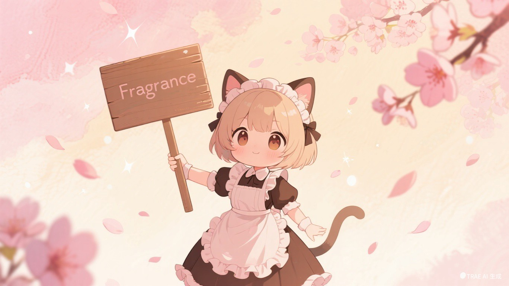

<div align="center">



<br />
<br />

<p>
  <sub>
    <samp>✦·˚ ༘</samp>
    &nbsp; 一款轻量、可高度定制的视觉小说引擎 &nbsp;
    <samp>·˚ ༘ ✦</samp>
  </sub>
</p>

<p>
  <sup>Electron · React 18 · TypeScript · Zustand</sup>
</p>

<p>
  <a href="https://github.com/Glimmer114514/fragrance_engine/blob/master/LICENSE">
    
  </a>
  <a href="#">
    
  </a>
  <a href="#">
    
  </a>
  <a href="#">
    
  </a>
</p>

<br />

<p>
  <samp>₊˚ʚ 🎀 在花瓣与光影之间，写下属于你的故事 🎀 ɞ˚₊</samp>
</p>

</div>

<br />

---

<br />

<div align="center">

## <samp>₊✧ 关于 Fragrance ✧₊</samp>

</div>

<br />

<p align="center">
  <samp>
    如果你有一个想讲的故事，但不想学 Python DSL，<br />
    也不想安装笨重的 Unity 编辑器 ——<br />
    <b>Fragrance</b> 就是为你准备的。
  </samp>
</p>

<p align="center">
  <samp>
    用 <b>JSON 写剧本</b>，用 <b>CSS 做皮肤</b>，<br />
    剩下的交给引擎。
  </samp>
</p>

<br />

<div align="center">

| 🎀 | |
|:-:|:-|
| 🎭 **剧本驱动** | JSON 剧本：`dialogue` · `narration` · `choice` · `branch` |
| 🎨 **完全可定制** | React 组件 + CSS 变量，换主题只需改色盘 |
| 💾 **10 槽存档** | IPC 文件存储 + `localStorage` 回退 |
| 🔁 **二周目** | 通关自动解锁隐藏路线 💫 |
| ⚙️ **游戏内设置** | 文字速度 · 自动播放 · 音量 · 全屏 |
| 📦 **一键打包** | `npm run package` → 一个 `.exe` |

</div>

<br />

---

<br />

<div align="center">

## <samp>🌸 快速开始</samp>

</div>

<br />

```bash
# ๑ 领养一只 Fragrance
git clone https://github.com/Glimmer114514/fragrance_engine.git
cd fragrance_engine

# ๑ 去商店买猫粮（安装依赖）
npm install

# ๑ 对小猫咪说 "启动！"（Windows 可双击 dev.bat）
npm run dev

# ๑ 打包成便携猫箱（安装包）
npm run package
```

<div align="center">
  <p>
    <samp>
      <sup>✦ 需要 Node.js 18+ &nbsp;·&nbsp; npm 9+ ✦</sup>
    </samp>
  </p>
</div>

<br />

---

<br />

<div align="center">

## <samp>📜 最早的一份剧本</samp>

</div>

<br />

<p align="center">
  <samp>一个 JSON 数组，引擎逐条念给你听。</samp>
  <br />
  <samp><sub>遇到对话 / 旁白 / 选项时会停下来，等你轻轻点一下。</sub></samp>
</p>

```json
[
  { "type": "scene",  "id": "start" },

  { "type": "bg",  "src": "classroom",   "effect": "fade" },
  { "type": "bgm", "src": "afternoon",   "loop": true, "volume": 0.6 },
  { "type": "char", "id": "sakura",      "pose": "shy", "pos": "center" },

  { "type": "dialogue", "speaker": "小樱", "text": "……你来了。" },
  { "type": "narration", "text": "她的声音很轻，像落在水面上的花瓣。" },

  { "type": "end" }
]
```

<br />

<details>
<summary><samp>🌸 点击展开全部指令速查表</samp></summary>

<br />

| 分类 | 指令 | 说明 |
|:--|:--|:--|
| 🏷️ 场景 | `scene` · `end` | 场景标记（跳转锚点）· 结束返回标题 |
| 🖼️ 视觉 | `bg` · `char` · `cg` | 背景 · 角色立绘 · 全屏插画 |
| 💬 文本 | `dialogue` · `narration` | 对话 · 旁白（阻塞指令） |
| 🔀 流程 | `choice` · `jump` · `branch` · `setFlag` · `wait` | 分支 · 跳转 · 条件 · 变量 · 等待 |
| 🎵 音频 | `bgm` · `sfx` | 背景音乐 · 音效 |

</details>

<br />

---

<br />

<div align="center">

## <samp>💕 写出爱与选择</samp>

</div>

<br />

<p align="center">
  <samp>每个选项都可以改变好感度，也可以被 <b>cond</b> 魔法般地隐藏。</samp>
</p>

```json
{
  "type": "choice",
  "prompt": "要怎么回应她的期待？",
  "options": [
    {
      "text": "握住她的手",
      "next": { "type": "jump", "target": "hold_hand" },
      "setFlag": { "affection": 2 }
    },
    {
      "text": "假装没看到，低头翻书",
      "next": { "type": "jump", "target": "ignore" },
      "setFlag": { "affection": -1 }
    },
    {
      "text": "（轻声）……我一直在等你",
      "next": { "type": "jump", "target": "confession" },
      "cond": "flags.week2"
    }
  ]
}
```

<div align="center">
  <samp><sub>✦ 选项 ✦ 好感度 ✦ 条件隐藏 ✦ 多结局 ✦</sub></samp>
</div>

<br />

---

<br />

<div align="center">

## <samp>🍰 项目结构小蛋糕</samp>

</div>

<br />

```
fragrance_engine/
│
├── electron/                          # 🖥️ Electron 主进程
│   ├── main/index.ts                  # 窗口 · IPC 存档
│   └── preload/index.ts               # 安全的桥
│
├── src/                               # 🎮 React 渲染进程
│   ├── engine/                        # ⚙️ 核心引擎
│   │   ├── types.ts                   # 指令类型定义
│   │   └── ScriptEngine.ts            # 解释器 & 条件求值
│   ├── stores/                        # 🧠 状态管理
│   │   ├── gameStore.ts               # 游戏运行时
│   │   └── settingsStore.ts           # 设置（持久化）
│   ├── components/                    # 🎨 UI 组件
│   │   ├── GameScreen.tsx             # 🏠 主舞台 & 路由
│   │   ├── TitleScreen.tsx            # 🌸 花瓣标题画面
│   │   ├── DialogueBox.tsx            # 💬 对话卡片
│   │   ├── ChoicePanel.tsx            # 🔀 选择面板
│   │   ├── PauseMenu.tsx              # ⏸️ 暂停菜单
│   │   └── SettingsPanel.tsx          # ⚙️ 设置
│   └── assets/styles/global.css       # 🎀 主题色盘
│
├── resources/scripts/                 # 📜 剧本 JSON
├── dev.bat                            # 🚀 一键启动
└── 使用手册.md                         # 📖 中文指南
```

<br />

---

<br />

<div align="center">

## <samp>⌨️ 键盘魔法</samp>

</div>

<br />

<table align="center">
  <tr>
    <td align="right"><samp>标题画面</samp></td>
    <td><kbd>Enter</kbd></td>
    <td><samp>→ 开始冒险</samp></td>
  </tr>
  <tr>
    <td align="right"><samp>标题画面</samp></td>
    <td><kbd>Esc</kbd></td>
    <td><samp>→ 关上大门</samp></td>
  </tr>
  <tr>
    <td align="right"><samp>游戏中</samp></td>
    <td><kbd>Esc</kbd></td>
    <td><samp>→ 暂停休息</samp></td>
  </tr>
  <tr>
    <td align="right"><samp>菜单内</samp></td>
    <td><kbd>Esc</kbd></td>
    <td><samp>→ 回到故事</samp></td>
  </tr>
</table>

<br />

---

<br />

<div align="center">

## <samp>🏗️ 引擎的小心脏</samp>

</div>

<br />

```
   📜 剧本 JSON
        │
        ▼
  ⚙️ ScriptEngine ──▶ 🧠 Zustand Store ◀── 🎨 React 组件
        │                      │
        │               💾 SaveManager
        │                      │
        ▼                      ▼
   📖 解释执行           🗄️ 本地文件系统
```

<br />

<p align="center">
  <samp>
    <b>阻塞模型：</b>批量指令一口气跑完，遇到对话就乖乖等你戳一下。
  </samp>
</p>

<br />

---

<br />

<div align="center">

## <samp>💌 致创作者</samp>

</div>

<br />

<p align="center">
  <samp>
    这是一个小小的引擎，不完美，但足够真诚。<br />
    如果你用它做出了什么有趣的东西，<br />
    请一定让我知道。
  </samp>
</p>

<br />

<div align="center">

<p>
  <samp>· • ✦ 期待你的故事 ✦ • ·</samp>
</p>

<br />

<a href="https://github.com/Glimmer114514/fragence_engine">
  
</a>

<br />
<br />

<p>
  <sub>
    <samp>
      crafted with ♡ · <a href="https://react.dev">React</a> · <a href="https://www.electronjs.org">Electron</a> · <a href="https://github.com/pmndrs/zustand">Zustand</a>
    </samp>
  </sub>
</p>

<p>
  
</p>

</div>

<br />
<br />
